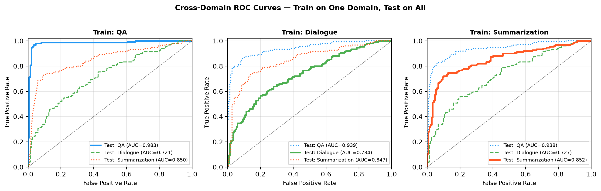

# Cross-Domain Generalization of Lightweight Hallucination Detectors in LLMs

[](https://www.python.org/)
[](LICENSE)
[](https://huggingface.co/datasets/pminervini/HaluEval)
[]()

> **Author:** Azeem Sher — Department of Computer Science, UET Taxila  
> **Research Area:** Trustworthy AI · LLM Hallucination Detection · Cross-Domain Generalization

---

## 📌 Overview

This repository contains the full code, data, and paper for an empirical pilot study investigating the **cross-domain generalization gap** of lightweight hallucination detectors in Large Language Models (LLMs).

### Research Question
> *Do lightweight, compute-efficient hallucination detection features (semantic similarity + lexical metrics) generalize across distinct NLP domains (QA → Dialogue → Summarization) without significant performance degradation?*

### Key Finding
Our combined feature set achieves:
- **In-domain AUROC: 0.856**
- **OOD AUROC: 0.837**
- **Generalization Gap: only +0.019** ✅

This demonstrates that lightweight features transfer almost perfectly across entirely distinct NLP tasks — without any LLM generation at inference time.

---

## 📊 Results

### Cross-Domain AUROC Transfer Matrix

| Train \ Test | QA | Dialogue | Summarization |
|---|---|---|---|
| **QA** | **0.983** | 0.721 | 0.850 |
| **Dialogue** | 0.939 | **0.734** | 0.847 |
| **Summarization** | 0.938 | 0.727 | **0.852** |

### Feature-Level Generalization Gap

| Feature | In-Domain | OOD Avg | Gap (Δgen) |
|---|---|---|---|
| F1 — Semantic Similarity | 0.684 | 0.684 | +0.000 |
| F2 — Response Length | 0.852 | 0.851 | +0.001 |
| F3 — Word Overlap | 0.711 | 0.711 | +0.000 |
| F4 — Unique Word Ratio | 0.649 | 0.649 | +0.000 |
| **F_ALL — Combined** | **0.856** | **0.837** | **+0.019** |

### ROC Curves

### ROC Curves

<p align="center">
  
</p>

---

## 🗂️ Repository Structure

```
halueval-cross-domain-hallucination/
├── src/
│   ├── extract_features.py      # Feature extraction (sentence-transformers + lexical)
│   └── evaluate.py              # Cross-domain AUROC evaluation
├── results/
│   ├── qa_fast_features.csv         # QA domain features (300 rows)
│   ├── dialogue_fast_features.csv   # Dialogue domain features (300 rows)
│   ├── summarization_fast_features.csv  # Summarization features (300 rows)
│   └── auroc_fast_results.json      # Full AUROC matrix results
├── figures/
│   └── roc_curves.png           # Cross-domain ROC curve visualization
├── paper/
│   └── ieee_paper_final.tex     # Full IEEE-format LaTeX paper
├── requirements.txt
└── README.md
```

---

## ⚙️ Installation

```bash
git clone https://github.com/azeemsher42/halueval-cross-domain-hallucination.git
cd halueval-cross-domain-hallucination
pip install -r requirements.txt
```

---

## 🚀 Reproducing Results

### Step 1: Extract Features
```bash
python src/extract_features.py
```
This will download the HaluEval dataset from HuggingFace and extract all four features (F1–F4) for all three domains. Results are saved to `results/`.

### Step 2: Run Cross-Domain Evaluation
```bash
python src/evaluate.py
```
This produces the full 3×3 AUROC transfer matrix and saves the results to `results/auroc_fast_results.json`.

---

## 📋 Dataset

We use the publicly available **HaluEval** benchmark:
- **Source:** `pminervini/HaluEval` on HuggingFace
- **Domains:** QA, Dialogue, Summarization
- **Sample size:** 150 balanced pairs per domain (300 total per domain: 150 factual + 150 hallucinated)
- **Citation:** Li et al., EMNLP 2023

---

## 🧠 Methodology

### Features Extracted
| ID | Feature | Description | Computation |
|---|---|---|---|
| F1 | Semantic Similarity | Cosine sim between context and answer embeddings | `all-MiniLM-L6-v2` (22M params) |
| F2 | Response Length | Character count of the answer | `len(answer)` |
| F3 | Lexical Overlap | Jaccard similarity of word sets | `\|W(C) ∩ W(A)\| / \|W(C) ∪ W(A)\|` |
| F4 | Unique Word Ratio | Lexical diversity of the answer | `unique_words / total_words` |

### Classifier
Logistic Regression with StandardScaler (scikit-learn). Simple linear models chosen deliberately to avoid domain-specific overfitting.

### Evaluation
- Train on one source domain, test on all three target domains
- Primary metric: AUROC (threshold-agnostic, robust to class imbalance)
- Generalization Gap: Δgen = AUROC_in-domain − AUROC_OOD-avg

---

## 📄 Paper

The full IEEE-format paper is available in `paper/ieee_paper_final.tex`.

Compile with Overleaf or locally:
```bash
pdflatex paper/ieee_paper_final.tex
```

**Citation (Working Paper):**
```bibtex
@article{sher2026crossdomain,
  title   = {Cross-Domain Generalization of Lightweight Hallucination Detectors 
             in Large Language Models},
  author  = {Sher, Azeem},
  journal = {Working Paper},
  year    = {2026},
  url     = {https://github.com/azeemsher42/halueval-cross-domain-hallucination}
}
```

---

## 🔮 Future Work

- [ ] Scale to 1,000+ samples per domain
- [ ] Evaluate on medical (MedQA) and legal (LegalBench) domains
- [ ] Compare against SelfCheckGPT and Semantic Entropy baselines
- [ ] Explore domain-adversarial training to further close the generalization gap
- [ ] Submit to IEEE Access or EMNLP 2027 Short Paper track

---

## 📜 License

MIT License — see [LICENSE](LICENSE) for details.

---

## 📬 Contact

**Azeem Sher**  
Department of Computer Science, UET Taxila  
📧 22-cs-23@students.uettaxila.edu.pk  
🌐 [GitHub](https://github.com/azeemsher42)
